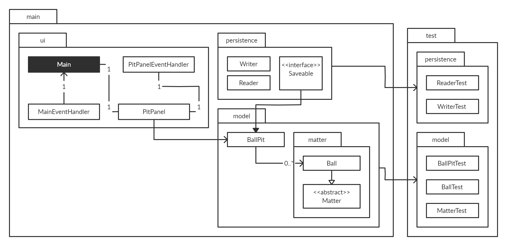

<!-- PROJECT LOGO -->
 

    
    <h2 align="center" >Virtual Ball Pit</h2>

  

    A simple two-dimensional physics engine simulating inelastic collisions between balls and their surroundings. Term project for the CPSC 210 (Software Construction) course at UBC.
     
  

<!-- TABLE OF CONTENTS -->

## Table of Contents

* [Background](#background)
<!-- * [Demo](#demo) -->
* [Outline](#outline)
  * [UML Design Diagram](#uml-design-diagram)
  * [Class Hierarchy](#class-hierarchy)
* [Roadmap](#roadmap)
  * [Phase 1: Basic Model and User Interaction](#phase-1)
  * [Phase 2: Data Persistence](#phase-2)
  * [Phase 3: Graphical User Interface](#phase-3)
  * [Phase 4: Design](#phase-4)
<!-- * [Demo](#demo) -->

<!-- BACKGROUND -->

## Background

<!-- [![Product Name Screen Shot][product-screenshot]](https://example.com) -->

> _**What** does this application do?_

This project is able to simulate a 2 dimensional physical environment with object collisions under the effects of gravity and friction. In addition, objects may be 
created, saved, and loaded by a user, with specifiable physical attributes.

> _**Who** will use it?_

This project is primarily intended to be used by a younger demographic of students in an educational setting, where they can "get their hands dirty" and toy around with various physical phenomena.      

> _**Why** did I decide on this project idea?_

I thought that it was a challenging task to translate theoretical concepts I learned from other classes into concrete code which can accurately explain real-world phenomena, particularly that of momentum. Not only will this help me gain a deeper understanding of these concepts, but will also allow me to practice object-oriented programming techniques to solve problems.

<!-- OUTLINE -->

## Outline

* This program is written in [**Java**](https://java.com/en/download/).
* Unit testing is done with [**JUnit 5**](https://junit.org/junit5/).
* GUI written with [**Swing**](https://en.wikipedia.org/wiki/Swing_(Java)).

### UML Design Diagram

<!-- UML DESIGN DIAGRAM -->

<!-- CLASS HIERARCHY -->
### Class Hierarchy
- _Matter_ is an abstract class holding generic information regarding objects within the environment (e.g. mass, speed, and position).
- _Ball_ is a specific subclass of _Matter_, with properties specific to a ball (e.g. radius)
- _BallPit_ is an aggregate class of all of _Matter_ objects, and environment characteristics (e.g. width, height). 

<!-- ROADMAP -->

## Roadmap

<!-- ####Instructions for Grader
 - Step 1: create a new ball pit, or load the saved ball pit when opening the application
 - Step 2: to add ball to ball pit, click on settings icon, and add ball (or press "A")
 - Step 3: to trigger audiovisual component, use the arrow keys to make balls collide with each other
 - Step 4: to save ball pit, click save ball pit in settings.  -->

<!-- PHASE 1 -->
### Phase 1: Program Functionality
As a user, some of the things I want the program to do are...
- [x] see the balls _move_
- [x] _add_ balls to the BallPit
- [x] _delete_ balls from the BallPit
- [x] see the balls _interact_ with each other and the environment

<!-- PHASE 2 -->
### Phase 2: Data Persistence
As a user, I want to features that allow me to...
- [x] _save_ the current state of the sandbox locally
- [x] _load_ another sandbox's state
- [x] _prompt_ me to save when exiting the sandbox

<!-- PHASE 3 -->
### Phase 3: Graphical User Interface

In order to refactor the program from a console application to an application with a GUI, I implemented a _Main_ class to handle displaying the main menu with data persistence options, and a _PitPanel_ class to display the instantiated _BallPit_ object, along with corresponding controls.

<!-- PHASE 4 -->
### Phase 4: Design

#### Code Robustness
I chose to re-design a class such that it is robust. Particularly, I decided to use this on the _Ball_ class, such that balls with impossible mass and radius cannot be constructed. The methods which use this robust design are the constructors which create each ball.

#### Cohesion and Coupling
I chose to fix poor cohesion regarding the _Main_ class. In this particular class, one of the main issues is that in addition to running the main program (specifically ball pit related functions), this class had also included methods responsible for mouse events and key events. To solve this lack of cohesion, I made a separate class to handle mouse events and key events called _MainEventHandler_.

A similar problem existed for the _PitPanel_ class, which should be responsible only for rendering the ball pit onto the JFrame. However, there was poor cohesion, as _PitPanel_ was also responsible for handling user input, in the form of key events and mouse events. To fix this poor cohesion, I made another class called _PitPanelEventHandler_ in order to handle key and mouse events from the user while the ball pit is being rendered.